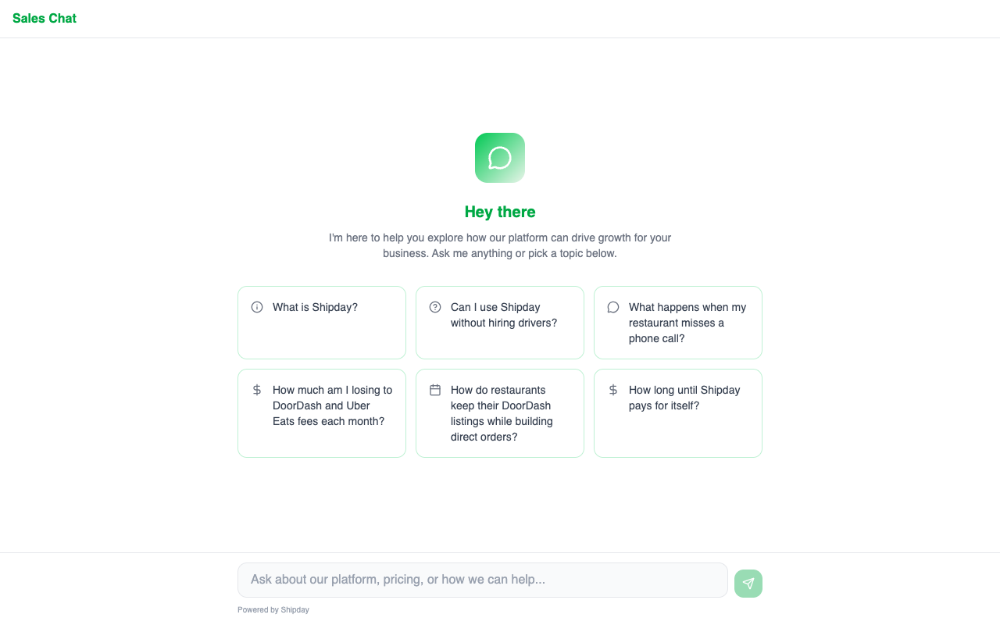

# Shipday AI Sales Agent

AI-powered sales agent I built for my role at Shipday -- handles inbound 24/7, qualifies prospects, computes ROI, and books demos.


-orange)


**Live demo:** [saleshub.mikegrowsgreens.com/chat](https://saleshub.mikegrowsgreens.com/chat)

---

## Screenshots

### Welcome Screen


*Shipday-branded chat with 6 discovery prompts. Additional screenshots (discovery conversation, ROI computation, demo booking) available in the [live demo](https://saleshub.mikegrowsgreens.com/chat).*

---

## How It Works

1. **Prospect arrives** -- lands on the chat widget or receives a phone call
2. **Discovery** -- the agent asks one question at a time, extracting order volume, ticket size, commission rates, and growth signals into a 13-slot qualification state machine
3. **ROI reveal** -- once 3+ core slots are filled, the agent computes annual savings with real math and presents an inline SVG chart with exact dollar figures
4. **Demo booking** -- the agent offers to book a demo, checks real-time calendar availability via tool calling, and books directly on Google Calendar with a Meet link

---

## AI Sales Chatbot

- **Dynamic system prompt engine** -- 400+ lines of context injection that encodes a full sales methodology. Not a static prompt; it rebuilds per-turn based on qualification state, brain knowledge, and conversation stage.
- **13-slot qualification state machine** -- extracts business data (order volume, AOV, commission rates, locations, growth signals) from natural conversation and auto-stages through discovery, implication, ROI, and close.
- **Brain-injected playbook** -- loads winning phrases, call patterns, objection handlers, and ROI stories from a knowledge database. The AI uses phrases that have closed deals before.
- **Real-time ROI computation** -- takes qualification data, computes annual savings with real math, generates inline SVG charts, and presents exact dollar figures.
- **Calendar booking via tool calling** -- AI books demos mid-conversation using Claude's tool_use protocol with race-condition-safe database locks and Google Calendar FreeBusy conflict detection.
- **5-fence guardrail system** -- topic, pricing, competitor, promise, and PII fences with real-time conversation quality scoring and escalation detection.

---

## AI Phone Agent

- **WPM pacing mirroring** -- measures prospect speaking speed via Deepgram word timings, adjusts ElevenLabs TTS speed to match (0.85x-1.1x).
- **Barge-in context preservation** -- when a prospect interrupts, stops TTS, captures their speech, and passes interrupted context to Claude for coherent resumption.
- **Pre-cached filler audio** -- 8 context-aware filler phrases generated as audio on startup. If Claude takes >400ms, a filler plays instantly. No dead air.
- **Contextual callbacks** -- tracks topics the prospect mentions, weaves them back naturally later in conversation.
- **Call quality degraded mode** -- monitors STT confidence and connection quality, automatically shortens responses on poor connections.
- **Strategic pauses** -- 1.5-second pause after presenting a big ROI number to let it land.
- **Warm handoff** -- transfers to human reps with full context (qualification state, objections raised, mood assessment, suggested next action).

---

## Guardrail System

```
Input
  |
  v
+--[ PII Fence ]--+  Hard reject: SSN, credit card, bank account,
|  PASS  |  BLOCK  |  driver license, passport patterns
+--------+---------+
  |
  v
+--[ Topic Fence ]-+  Redirect: politics, religion, legal,
|  PASS  |  BLOCK   |  investments, personal advice
+---------+---------+
  |
  v
+--[ Pricing Fence ]+  Route to human: discount requests,
|  PASS  |  ESCALATE |  free trials, price negotiation
+---------+----------+
  |
  v
+--[ Competitor Fence ]+  Reframe: competitor mentions,
|  PASS  |  REFRAME    |  force value-differentiation
+---------+-------------+
  |
  v
+--[ Promise Fence ]+  Soften: guarantees, certainties,
|  PASS  |  SOFTEN   |  enforce "typically see" language
+---------+----------+
  |
  v
  Quality Score (0-100) + Escalation Detection
```

---

## Calendar Booking

- Checks real-time availability via Google Calendar FreeBusy API through Claude tool calling
- Race-condition-safe booking with `FOR UPDATE` database locks
- Automatic Google Meet link generation
- Timezone-aware slot computation with buffer handling

---

## Tech Stack

| Layer | Technology |
|-------|-----------|
| Framework | Next.js 14 (App Router) |
| Frontend | React 19, Tailwind CSS 4, TypeScript |
| Database | PostgreSQL (DigitalOcean managed) |
| AI | Anthropic Claude (Sonnet + Haiku model routing) |
| Voice STT | Deepgram Nova-2 (real-time WebSocket) |
| Voice TTS | ElevenLabs Turbo v2.5 |
| Telephony | Twilio Media Streams |
| Calendar | Google Calendar API (OAuth2 + FreeBusy) |

---

## Architecture

### Web Chatbot Flow

```
Browser
  |
  POST /api/chat/prospect
  |
  +-- Rate limit check (per-IP)
  +-- Load brain content (cached: winning phrases, call patterns, ROI stories)
  +-- Load live sales metrics (win rate, avg MRR, top phrases)
  +-- Extract qualification slots from conversation history
  +-- Compute ROI if 3+ core slots filled (orders/week, AOV, commission)
  +-- Build dynamic system prompt (400+ lines):
  |     - Identity + conversation rules
  |     - 5-fence guardrail context
  |     - Qualification state + stage-specific instructions
  |     - Brain knowledge + playbook patterns
  |     - ROI data + calendar instructions
  |
  +-- Claude API (Haiku for early discovery, Sonnet for closing/tools)
  |     |
  |     +-- Tool calling loop (max 3 iterations):
  |           +-- check_availability -> computeAvailableSlots() -> Google FreeBusy
  |           +-- book_demo -> createBooking() -> Google Calendar event + Meet link
  |
  +-- Post-processing:
        +-- Extract qualification slots from response
        +-- Log conversation (PII-redacted)
        +-- Return: reply, suggested prompts, qualification state, ROI chart
```

### Voice Agent Flow

```
Incoming Call (Twilio)
  |
  WebSocket (Twilio Media Stream)
  |
  +-- Deepgram STT (streaming, real-time)
  |     +-- Word timings -> WPM calculation -> pacing update
  |     +-- Confidence tracking -> quality monitoring
  |
  +-- Utterance Buffering (1500ms timeout for speech_final)
  |
  +-- Conversation Manager:
  |     +-- Update qualification slots (13 data points)
  |     +-- Check handoff triggers (frustration, pricing, high intent)
  |     +-- Detect contextual callback opportunities
  |     +-- Build voice system prompt (1-2 sentences, no formatting)
  |     +-- Claude API with calendar tools
  |     +-- Tool calling loop (HTTP to scheduling API, max 3 iterations)
  |
  +-- ElevenLabs TTS (streaming)
  |     +-- Dynamic speed matching prospect WPM
  |     +-- Filler audio if Claude latency > 400ms
  |     +-- Strategic pause after ROI reveal (1.5s)
  |
  +-- Barge-in Detection:
  |     +-- Stop TTS mid-sentence
  |     +-- Clear audio buffer
  |     +-- Capture prospect speech
  |     +-- Pass interrupted context to Claude
  |
  +-- Post-Call Processing:
        +-- Archive transcript
        +-- Extract patterns for brain learning
        +-- Create touchpoint
```

See [docs/ARCHITECTURE.md](docs/ARCHITECTURE.md) for detailed component diagrams.

---

## Getting Started

### Prerequisites

- Node.js 18+
- PostgreSQL 15+
- Anthropic API key
- Google Calendar OAuth credentials (for booking)
- Twilio account (for voice agent)
- Deepgram API key (for voice STT)
- ElevenLabs API key (for voice TTS)

### Setup

```bash
# Clone the repository
git clone https://github.com/mikegrowsgreens/shipday-sales-agent.git
cd shipday-sales-agent

# Install dependencies
npm install

# Copy environment template
cp .env.example .env.local

# Required environment variables:
# ANTHROPIC_API_KEY=sk-ant-...
# DATABASE_URL=postgresql://...
# GOOGLE_CLIENT_ID=...
# GOOGLE_CLIENT_SECRET=...
# TWILIO_ACCOUNT_SID=...
# TWILIO_AUTH_TOKEN=...
# DEEPGRAM_API_KEY=...
# ELEVENLABS_API_KEY=...

# Run database migrations
npm run migrate

# Start the development server
npm run dev

# Start the voice agent (separate process)
npm run voice:dev
```

### Key Files

```
src/
  app/
    chat/page.tsx              # Chat page
    api/chat/prospect/route.ts # Chat API endpoint (880 lines)
    api/scheduling/            # Booking API endpoints
  components/
    prospect-chat/             # Chat widget component
  lib/
    ai.ts                      # Core AI engine (2,914 lines)
    guardrails.ts              # 5-fence guardrail system (683 lines)
    scheduling.ts              # Calendar booking engine
    google-calendar.ts         # Google Calendar integration
  voice-agent/                 # Separate PM2 process
    server.ts                  # Express + Twilio WebSocket (618 lines)
    conversation-manager.ts    # Voice AI brain (1,054 lines)
    stt.ts                     # Deepgram STT pipeline
    tts.ts                     # ElevenLabs TTS + filler cache
    handoff.ts                 # Warm transfer
    post-call.ts               # Post-call processing
    call-quality.ts            # Connection monitoring
```

---

## License

MIT License. See [LICENSE](LICENSE) for details.

---

Built by [Mike Paulus](https://linkedin.com/in/mikepaulus) while selling at [Shipday](https://shipday.com).
